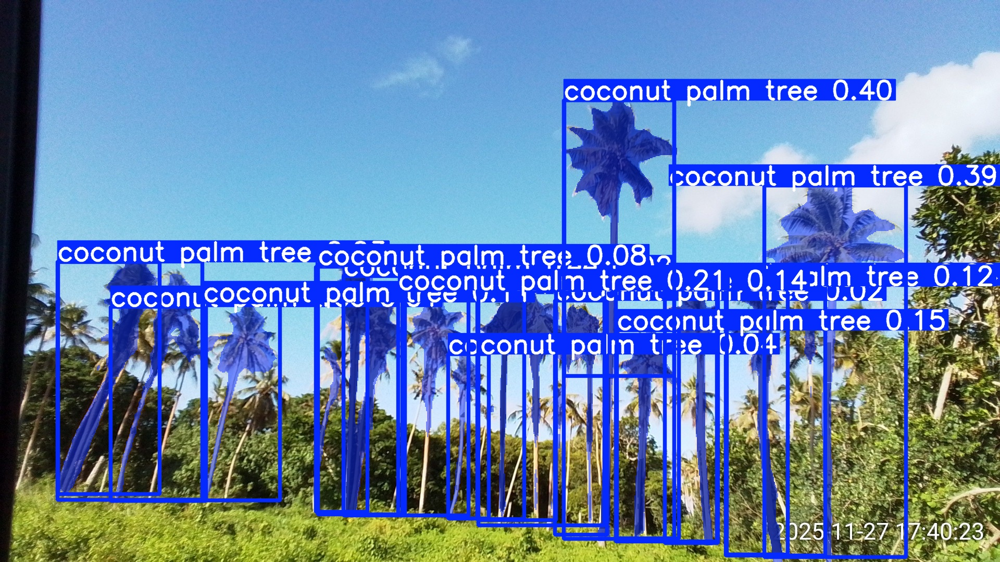
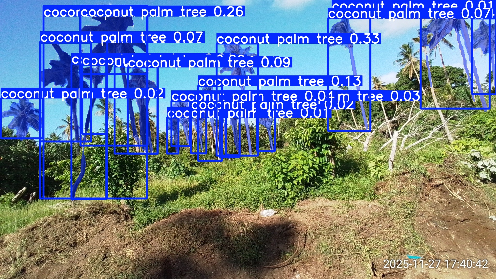
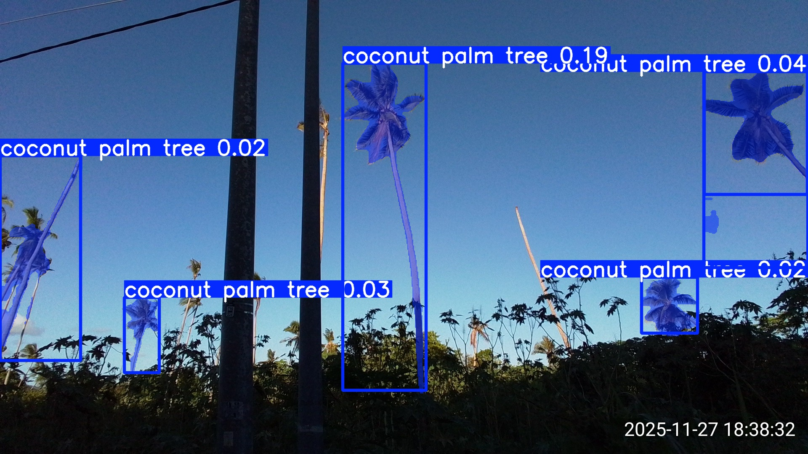

# 2025-12-12

## Interactive web map
The latest version of the web map is at https://aubreymoore.github.io/Efate2025/webmap/wm/.
There are a couple of problems with the map that need to be fixed:
1. In the layers box at the top right, icons for the point symbols are missing.
2. When hovering over a point, the corresponding mage should be displayed in a popup. Not happenining for some reason.
3. Map does not respond to zoom level provided in url.

## Object detection within original images
I am using a the `yoloe-11l-seg` model to detect coconut palms within the original images.
There are some obvious problems which need to be addressed, but this model does an awesome job out of the box with no retraining or fine tuning and just a few lines of code. 

All 3,985 images were processed in less than 4 minutes,
detecting 17,072 coconut palms. Here is a random sample of just 3 of 2,114 annotated images:

20251127_174023.jpg

20251127_183832.jpg

20251127_183832.jpg

## Miscellaneous comments
- original images were taken using a hand-held smart phone
- looks like a mixture of single images and time lapse images (using the Open Camera App?)
- images have a timestamp at bottom right corner. This is unnecesary because the the EXIF
metadata embedded in each image file contains timestamp and GPS coordinates. Stamping the 
actual image should be discouraged because it may confuse detection models.
- a few images were apparently acquired from a canoe. Very cool.
