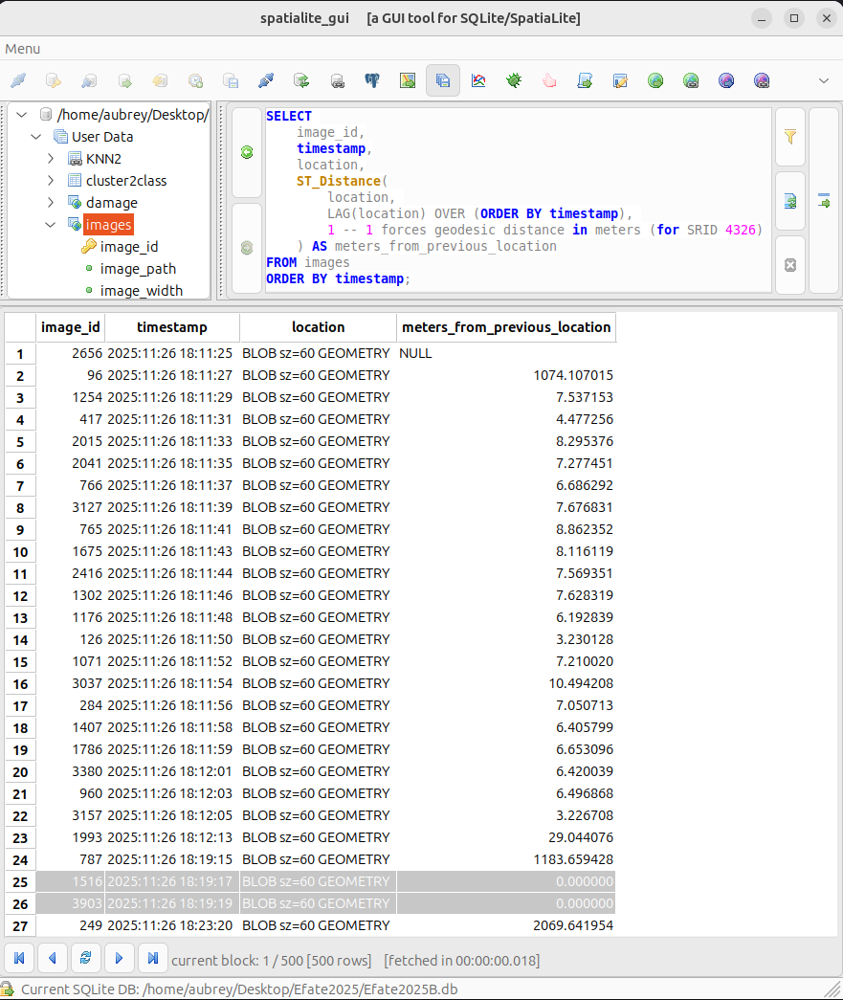
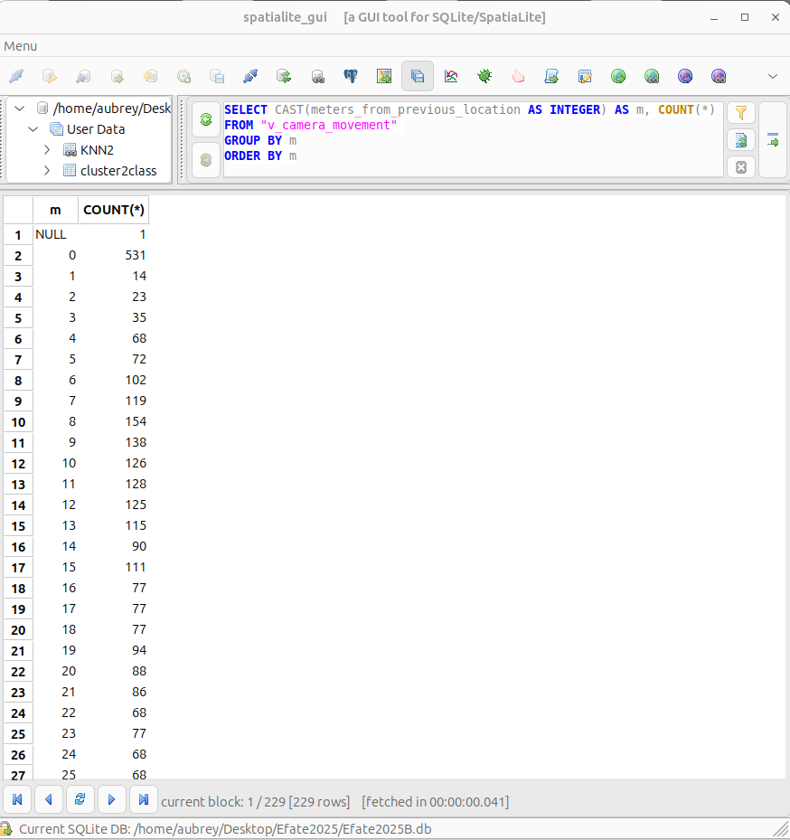

# Handling duplicate images

## Question 

**From Sarah Mansfield, Bioeconomy Science Institute, New Zealand**

Great to see the progress being made with the automated detection, the underlying programming for the system has really advanced. One question regarding the image processing – how do you handle duplication (through image overlap) of palms within the dataset? If the same palm is counted multiple times, that will affect the data. I’m familiar with the photo survey and there’s many palms that appear in more than one photo due to the high density of palms in key areas around Efate. When I’m assessing palm photos manually, I check for duplication/overlap between photos and where that is present, use the best image (most palms included and/or highest visual quality) as the basis for damage assessment. Is it possible for the program to recognize when the same palm appears in multiple images? Looking at the level of detail in the frond scanning, that seems a possibility although dead palms may be a significant challenge!

## Answer

Thanks for this great question, Sarah. As you suggest, we can identify duplicated tree images by measuring visual similarity for all coconut palm trees segmented from background by SAM3. But this is computationally expensive because we have to compare every tree with every other tree. Thats N * (N-1) comparisons where N is 26,987 trees in the Efate2025 dataset.

I suggest a more efficient way. We don't have an exact location for each detected tree in the dataset, but we do have a timestamp and GPS coordinates for the camera location of each image. We can use these data to measure distance in meters between successive images and then flag any images taken within only a few meters of the previous image as "probable duplicates" and filter these out for further analysis. 

I tried this idea out with the Efate2025 data.

- Calculating **meters_from_previous_location** was easy and almost instantaneous (only 18 ms) because the survey data are stored in a SpatiaLite database. If you look at the **spatialite_gui** screenshot, you will see that images in row 24, 25, and 26 were apparently shot from the same location.

- Downloading the 3 corresponding images from the Efate25 Survey Internet Archive confirms that these images are near-duplicates.

### Query to calculate meters between camera locations for successive images
```sql
SELECT 
    image_id,
    timestamp,
    location,
    ST_Distance(
        location, 
        LAG(location) OVER (ORDER BY timestamp), 
        1 -- 1 forces geodesic distance in meters (for SRID 4326)
    ) AS meters_from_previous_location
FROM images
ORDER BY timestamp;
```


### Camera movement histogram


### Images identified as "probable duplicates"

Note that these 3 images were downloaded directly from the [Efate25 Internet Archive](https://archive.org/details/efate-2025) when you opened this page.


